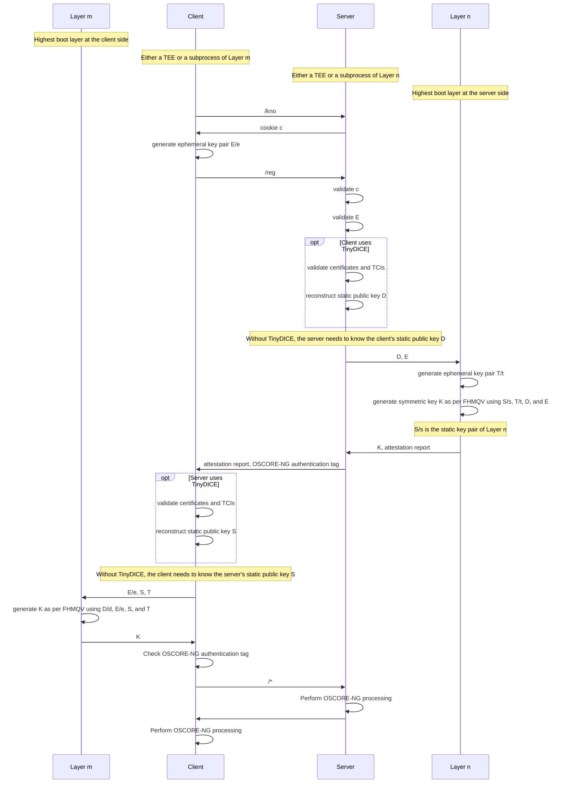

IETF and IEEE protocols for low-power power and lossy networks target the consumer IoT, where security and reliability requirements are relaxed. Industrial and medical applications, however, require more secure and more reliable protocols. For such applications, this repo implements the following protocol stack:

| Layer                 | Protocol(s)                                                                                                                                            |
| :---                  | :---                                                                                                                                                   |
| Application           | CoAP, [OSCORE-NG](#oscore-ng-object-security-for-constrained-restful-environments-next-generation), [IRAP](#irap-implicit-remote-attestation-protocol) |
| Transport             | UDP                                                                                                                                                    |
| Network               | IPv6                                                                                                                                                   |
| Adaption              | 6LoWPAN (in mesh-under mode)                                                                                                                           |
| Medium access control | [SMOR](#smor-secure-multipath-opportunistic-routing), [CSL](#csl-coordinated-sampled-listening)                                                        |
| Physical              | IEEE 802.15.4                                                                                                                                          |

# OSCORE-NG: Object Security for Constrained RESTful Environments Next-Generation

OSCORE-NG is the most secure end-to-end security solution for the Constrained Application Protocol (CoAP). Please see [libcoap](https://github.com/kkrentz/libcoap), for the code and further information.

# IRAP: Implicit Remote Attestation Protocol

IRAP establishes an [OSCORE-NG](https://github.com/kkrentz/libcoap) session between a client and a server. As its key exchange protocol, IRAP adopts Fully Hashed Menezes-Qu-Vanstone (FHMQV), which saves communication and processing overhead compared to Diffie-Hellman.

Optionally, IRAP can establish attested channels, where the client, the server, or both are ensured of the other side's software and optionally even hardware integrity. This functionality is based on TinyDICE, a lightweight version of the Device Identifier Composition Engine (DICE), which, in turn, is a standard for implementing measured boot without TPMs.

IRAP comprises three CoAP request-response pairs:
1. The initial /kno request-response is part of IRAP's protection against denial-of-service and amplification attacks.
2. The subsequent /reg request-response performs an FHMQV key exchange and optionally the TinyDICE-based remote attestation.
3. The final request-response pair serves for key confirmation and can carry OSCORE-NG-protected application data already.

<details>

<summary>Protocol details</summary>


</details>

## Configuration

On [this page](https://github.com/kkrentz/filtering-proxy), there are instructions for setting up an example application, where we use IRAP and TinyDICE to filter out unwanted traffic in a remote TEE en-route.

## Code structure

- [os/services/filtering](https://github.com/kkrentz/contiki-ng/tree/master/os/services/filtering)
  - Contains common code for connecting to the remote TEE
- [os/services/tiny-dice](https://github.com/kkrentz/contiki-ng/tree/master/os/services/tiny-dice)
  - Contains a mock-up of TinyDICE; please find a proper implementation of TinyDICE [here](https://github.com/kkrentz/mcuboot/blob/main/docs/dice.md).
- [examples/filtering](https://github.com/kkrentz/contiki-ng/tree/master/examples/filtering)
  - Contains examples for en-route filtering

## Further Reading
- [DICE](https://www.microsoft.com/en-us/research/project/dice-device-identifier-composition-engine/)
- [En-route filtering](https://doi.org/10.1007/978-3-031-30122-3_24)
- [TinyDICE & IRAP](https://www.researchgate.net/publication/394424860_Streamlining_Security_Patches_and_Remote_Attestations_for_the_Internet_of_Things)

# SMOR: Secure Multipath Opportunistic Routing

Many state-of-the-art IoT technologies, such as Thread or Wi-SUN, employ the Routing Protocol for Low-Power and Lossy Networks (RPL), which is particularly vulnerable to compromised nodes. Our SMOR, by contrast, tolerates compromises of single nodes. Also, SMOR improves on RPL’s delays and packet delivery ratios.

## Comparison of SMOR with Requests for Comments (RFCs)

| Feature                                | RPL                | AODV               | DSR                | SMOR               |
| :---                                   | :---:              | :---:              | :---:              | :---:              |
| Tolerance of node failures             | :white_circle:¹    | :white_check_mark: | :white_check_mark: | :white_check_mark: |
| Migration to better links              | :white_circle:²    | :x:                | :x:                | :white_check_mark: |
| Economy of broadcasts                  | :white_check_mark: | :x:                | :x:                | :white_check_mark: |
| Support for point-to-point traffic     | :white_circle:³    | :white_check_mark: | :white_check_mark: | :white_check_mark: |
| Resilience to node compromises         | :x:                | :x:                | :x:                | :white_check_mark: |

¹ Failures of root nodes prevent network formation

² As RPL does not assess unused links, it may miss opportunities to migrate to better links

³ IPv6 packets may take detours via a root node or a common ancestor

## Code structure

- [os/services/smor](https://github.com/kkrentz/contiki-ng/tree/master/os/services/smor)
  - Contains the bulk of the code of SMOR

## Further Reading

- [Paper](https://doi.org/10.1016/j.comcom.2024.01.024)

# CSL: Coordinated Sampled Listening

The CSL MAC protocol for IEEE 802.15.4 networks, e.g., finds application in Thread. However, owing to vulnerabilities in CSL (even when enabling IEEE 802.15.4 security), a variant dubbed HPI-MAC should rather be used. HPI-MAC features:

- Low base energy consumption - HPI-MAC wakes up eight times per second, yielding a duty cycle of 0.5%
- Low energy consumption at the sender side by learning the wake-up times of neighboring nodes, as well as the clock drifts compared to neighboring nodes
- Burst forwarding for better throughput
- ML-based channel hopping and acknowledged broadcast frames for higher reliability
- High MAC layer security
  - Authentication and encryption of frames via pairwise session keys
  - Strong freshness, i.e., even delayed frames are recognized as replayed
  - Denial-of-sleep-resilient medium access control
  - Denial-of-sleep-resilient pairwise session key establishment

## Troubleshooting

Two parameters might need adaption to your radio environment:

```c
/* If the CCA threshold is too low, IEEE 802.15.4 nodes may end up sending never. */
#define CSL_CONF_CCA_THRESHOLD (-70) /* dBm */
/* The output power controls the communication range. */
#define CSL_CONF_OUTPUT_POWER (0) /* dBm */
```

To enable ML-based channel hopping in HPI-MAC (at the cost of higher latencies and RAM usage):

```c
#define CSL_CHANNEL_SELECTOR_CONF_WITH_D_UCB 1
```

Fewer channels can be configured to trade-off between reliability, latencies, and RAM usage:

```c
/* a subset of { 11, 12, ..., 26 } containing 1, 2, 4, 8, or 16 channels, such as: */
#define CSL_CONF_CHANNELS { 15, 20, 25, 26 }
```

## Code structure

- [os/services/akes](https://github.com/kkrentz/contiki-ng/tree/master/os/services/akes)
  - Contains the adaptive key establishment scheme (AKES)
- [os/net/mac/csl](https://github.com/kkrentz/contiki-ng/tree/master/os/net/mac/csl)
  - Contains the CSL MAC protocol
- [examples/akes/csl](examples/akes/csl)
  - Contains a simplistic example

## Supported Platforms

- CC2538-based platforms
- [Cooja](https://github.com/kkrentz/cooja) motes

## TODOs

- I am working to add support for CC13xx/CC26xx
- Currently, HPI-MAC is limited to `macCslInterval=0`. This is to obviate data request frames and to minimize the duration of periodic wake ups. However, some platforms do not support `macCslInterval=0`. Support for `macCslInterval!=0` is hence desirable. For securing data request frames, we may echo truncated OTP bits
- Autoconfigure CCA threshold
- Autoconfigure output power
- Disable or accelerate wake ups on mains-powered devices, such as border routers

## Further Reading
- [IEEE 802.15.4-compliant CSL](https://standards.ieee.org/ieee/802.15.4/11041/)
- [HPI-MAC](https://doi.org/10.25932/publishup-43930)
- [ML-based Channel Hopping](https://doi.org/10.1007/978-3-030-98978-1_3)
