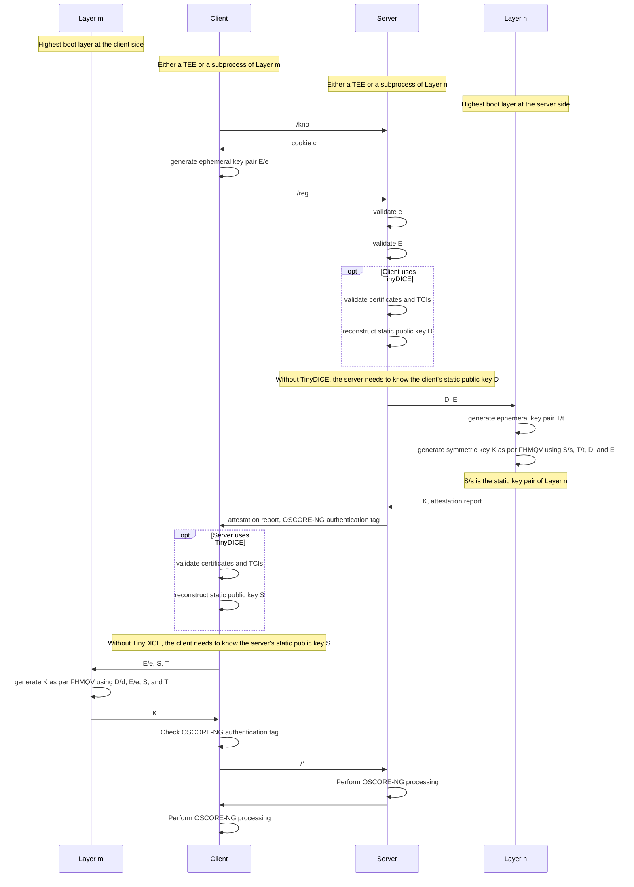

IETF and IEEE protocols for low-power power and lossy networks (LLNs) lack critical security features. They fall short of compromise resilience, denial-of-sleep resilience, and/or strong freshness. Therefore, this fork focuses on implementing a security-enhanced protocol stack for LLNs.

| Layer                 | Protocol(s)                                                                                                     |
| :---                  | :---                                                                                                            |
| Application           | CoAP, [OSCORE-NG](https://github.com/kkrentz/libcoap), TRAP, [IRAP](#irap-implicit-remote-attestation-protocol) |
| Transport             | UDP                                                                                                             |
| Network               | IPv6                                                                                                            |
| Adaption              | 6LoWPAN (in mesh-under mode)                                                                                    |
| Medium access control | [CSL](#csl-coordinated-sampled-listening), [SMOR](#smor-secure-multipath-opportunistic-routing)                 |
| Physical              | IEEE 802.15.4                                                                                                   |

# CSL: Coordinated Sampled Listening

CSL is a standardized MAC protocol for IEEE 802.15.4 networks. Its rationale is to send a stream of wake-up frames prior to an actual payload frame. Each wake-up frame essentially contains the time when the transmission of the payload frame will begin. This hint enables the receiver of a wake-up frame to sleep until the transmission of the payload frame is about to begin.

## Configuration

There are two main ways to use our CSL implementation. First, it is possible to adhere to the IEEE 802.15.4 standard. However, due to security vulnerabilities (even when enabling IEEE 802.15.4 security), this configuration is only meant for testing and research purposes. Second, it is possible to enable additional security measures.

### IEEE 802.15.4-Compliant CSL

For the standards-compliant configuration, add the following line to your `project-conf.h`
```c
/* auto-configures the MAC layer */
#include "net/mac/csl/csl-autoconf.inc"
```

Finally, in your Makefile, insert:
```
MAKE_MAC = MAKE_MAC_CSL
```

### Hasso Plattner Institute MAC (HPI-MAC)

For the secure configuration, aka HPI-MAC, add the following two lines to your `project-conf.h`:
```c
#define CSL_CONF_COMPLIANT 0
#include "net/mac/csl/csl-autoconf.inc"
```
and the following lines to your Makefile:
```c
MAKE_MAC = MAKE_MAC_CSL
MODULES += os/services/akes
```

For better reliability (at the cost of higher latencies), enable ML-based channel hopping:
```c
#define CSL_CHANNEL_SELECTOR_CONF_WITH_D_UCB 1
```
By default, blind channel hopping is used. Note, however, that ML-based channel hopping consumes a considerable amount of RAM.

### Troubleshooting

Two parameters might need to be adapted to your radio environment:

```c
/* If the CCA threshold is too low, IEEE 802.15.4 nodes may end up sending never. */
#define CSL_CONF_CCA_THRESHOLD (-70) /* dBm */
/* The output power controls the communication range. */
#define CSL_CONF_OUTPUT_POWER (0) /* dBm */
```

Besides, I observed an abnormally many collisions when using a laptop and a USB hub. It seems that OpenMotes do not get enough current in this scenario. To fix this, either plug in the power cable of your laptop or connect your OpenMotes without a USB hub.

## Features

HPI-MAC features:
- Low base energy consumption, e.g., 0.5% duty cycle when waking up eight times per second
- Low energy consumption at the sender side by learning the wake-up times of neighboring nodes, as well as the clock drifts compared to neighboring nodes
- Burst forwarding for better throughput
- ML-based channel hopping and acknowledged broadcast frames for higher reliability
- High MAC layer security
  - Authentication and encryption of frames via pairwise session keys
  - Strong freshness, i.e., even delayed frames are recognized as replayed
  - Denial-of-sleep-resilient medium access control
  - Denial-of-sleep-resilient pairwise session key establishment

## Code structure

- [os/services/akes](https://github.com/kkrentz/contiki-ng/tree/master/os/services/akes)
  - Contains the adaptive key establishment scheme (AKES)
- [os/net/mac/csl](https://github.com/kkrentz/contiki-ng/tree/master/os/net/mac/csl)
  - Contains the CSL MAC protocol

## Supported Platforms

- CC2538-based platforms
- [Cooja](https://github.com/kkrentz/cooja) motes

## TODOs

- Support newer platforms, such as CC13x4/CC26x4
- Currently, this CSL implementation is limited to `macCslInterval=0`. This is to obviate data request frames and to minimize the duration of periodic wake ups. However, some platforms do not support `macCslInterval=0`. Support for `macCslInterval!=0` is hence desirable. For securing data request frames, we may echo truncated OTP bits
- Autoconfigure CCA threshold
- Autoconfigure output power
- Disable or accelerate wake ups on mains-powered devices, such as border routers

## Further Reading
- [IEEE 802.15.4-compliant CSL](https://standards.ieee.org/ieee/802.15.4/11041/)
- [HPI-MAC](https://doi.org/10.25932/publishup-43930)
- [ML-based Channel Hopping](https://doi.org/10.1007/978-3-030-98978-1_3)

# SMOR: Secure Multipath Opportunistic Routing

Many state-of-the-art IoT technologies, such as Thread or Wi-SUN, employ the Routing Protocol for Low-Power and Lossy Networks (RPL), which is particularly vulnerable to compromised nodes. SMOR, by contrast, tolerates compromises of single nodes. Also, SMOR improves on RPL’s delays and packet delivery ratios.

## Comparison of SMOR with Requests for Comments (RFCs)

| Feature                                | RPL                | AODV               | DSR                | SMOR               |
| :---                                   | :---:              | :---:              | :---:              | :---:              |
| Tolerance of node failures             | :white_circle:¹    | :white_check_mark: | :white_check_mark: | :white_check_mark: |
| Migration to better links              | :white_circle:²    | :x:                | :x:                | :white_check_mark: |
| Economy of broadcasts                  | :white_check_mark: | :x:                | :x:                | :white_check_mark: |
| Support for point-to-point traffic     | :white_circle:³    | :white_check_mark: | :white_check_mark: | :white_check_mark: |
| Resilience to node compromises         | :x:                | :x:                | :x:                | :white_check_mark: |

¹ Failures of root nodes prevent network formation

² As RPL does not assess unused links, it may miss opportunities to migrate to better links

³ IPv6 packets may take detours via a root node or a common ancestor

## Further Reading

- [Paper](https://doi.org/10.1016/j.comcom.2024.01.024)

# IRAP: Implicit Remote Attestation Protocol

IRAP establishes an OSCORE-NG session between a client and a server. As its key exchange protocol, IRAP adopts Fully Hashed Menezes-Qu-Vanstone (FHMQV), which saves communication and processing overhead compared to Diffie-Hellman.

Optionally, IRAP can establish attested channels, where the client, the server, or both are ensured of the other side's software integrity. This functionality is based on TinyDICE, a lightweight version of the Device Identifier Composition Engine (DICE).

IRAP comprises three request-response pairs:
1. The /kno request-response protects against denial-of-service attacks like in DTLS or WireGuard.
2. The /reg request-response performs FHMQV and optionally the TinyDICE-based remote attestation.
3. The final request-response pair serves for key confirmation and can carry application data already.

The protocol details are shown below:


```mermaid
sequenceDiagram
participant Layer m
participant Client
participant Server
participant Layer n
Note over Layer m: Highest boot layer at the client side
Note over Client: Either a TEE or a subprocess of Layer m
Note over Server: Either a TEE or a subprocess of Layer n
Note over Layer n: Highest boot layer at the server side
Client->>Server: /kno
Server->>Client: cookie c
Client->>Client: generate ephemeral key pair E/e
Client->>Server: /reg
Server->>Server: validate c
Server->>Server: validate E
opt Client uses TinyDICE
    Server->>Server: validate certificates and TCIs
    Server->>Server: reconstruct static public key D
end
Note over Server: Without TinyDICE, the server needs to know the client's static public key D
Server->>Layer n: D, E
Layer n->>Layer n: generate ephemeral key pair T/t
Layer n->>Layer n: generate symmetric key K as per FHMQV using S/s, T/t, D, and E
Note over Layer n: S/s is the static key pair of Layer n
Layer n->>Server: K, attestation report
Server->>Client: attestation report, OSCORE-NG authentication tag
opt Server uses TinyDICE
    Client->>Client: validate certificates and TCIs
    Client->>Client: reconstruct static public key S
end
Note over Client: Without TinyDICE, the client needs to know the server's static public key S
Client->>Layer m: E/e, S, T
Layer m->>Layer m: generate K as per FHMQV using D/d, E/e, S, and T
Layer m->>Client: K
Client->>Client: Check OSCORE-NG authentication tag
Client->>Server: /*
Server->>Server: Perform OSCORE-NG processing
Server->>Client: 
Client->>Client: Perform OSCORE-NG processing
```

## Configuration

On [this page](https://github.com/kkrentz/filtering-proxy), there are instructions for setting up a demo, where a Contiki-NG client establishes an attested channel with a Keystone TEE.

## Further Reading
- [DICE](https://www.microsoft.com/en-us/research/project/dice-device-identifier-composition-engine/)